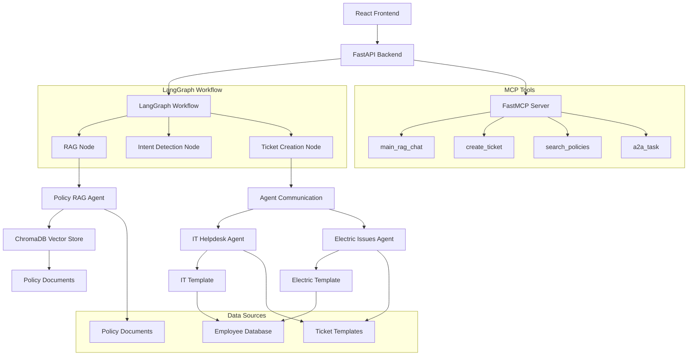
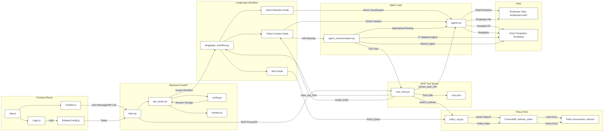

# SL-IT-AI: Advanced Multi-Agent IT Helpdesk System

<div align="center">


<!--  -->

**An intelligent multi-agent IT helpdesk system powered by [FastAPI](https://fastapi.tiangolo.com/), [LangGraph](https://github.com/langchain-ai/langgraph), [MCP (Model Context Protocol)](https://meghashyamthiruveedula.medium.com/model-context-protocol-a-comprehensive-guide-41c8b56a61f3), and [Azure OpenAI](https://azure.microsoft.com/en-us/products/ai-services/openai-service). Provides automated ticket creation, policy-based solutions, and intelligent agent-to-agent (A2A) communication for Systems Limited.**

[🚀 Quick Start](#-quick-start) • [🏗️ Architecture](#️-architecture) • [🔧 Features](#-features) • [📁 Project Structure](#-project-structure) • [🧪 Testing](#-testing)

</div>

---

## 🎯 **Project Overview**

SL-IT-AI is a comprehensive IT helpdesk solution that combines the power of AI with traditional support workflows. The system automatically classifies issues, provides immediate solutions, and creates structured support tickets with minimal user input.

### ✨ **Key Features**

- 🤖 **AI-Powered Chatbot** with natural language understanding
- 📋 **Automated Ticket Creation** with smart field extraction
- 🔍 **Policy-Based Solutions** using RAG (Retrieval-Augmented Generation)
- 🏢 **Employee Database Integration** for automatic user information
- 🔄 **Multi-Agent Communication** (A2A) for specialized issue handling
- 📱 **Modern Web Interface** with real-time chat capabilities
- 🔐 **Secure Authentication** via Firebase
- 📊 **Comprehensive Issue Classification** (IT vs Electric issues)

---

## 🚀 **Quick Start**

### **Prerequisites**
- Python 3.11+
- Node.js 16+
- Azure OpenAI API key
- Firebase project (for authentication)

### **Installation**

1. **Clone the repository**
    ```bash
    git clone <repository-url>
    cd SL-IT-AI
    ```

2. **Install backend dependencies**
    ```bash
    cd backend
    pip install -r requirements.txt
    ```

3. **Install frontend dependencies**
    ```bash
    cd ../frontend
    npm install
    ```

4. **Configure environment variables**
    ```bash
    # Backend/.env
    AZURE_OPENAI_API_KEY=your_azure_openai_key
    AZURE_OPENAI_API_BASE=your_azure_endpoint
    AZURE_OPENAI_DEPLOYMENT_NAME=gpt-4o

    # Frontend environment variables (if needed)
    REACT_APP_API_URL=http://localhost:8000
    ```

### **Running the Application**

**Option 1: Use the Python startup script (Recommended)**
```bash
# Start both backend servers (FastAPI + MCP)
cd backend
python start_servers.py
```

**Option 2: Manual startup**
```bash
# Terminal 1: Start MCP Server (Port 8001)
cd backend
python mcp_tools.py

# Terminal 2: Start FastAPI Server (Port 8000)
cd backend
python -m uvicorn main:app --reload --host 0.0.0.0 --port 8000

# Terminal 3: Start React Frontend (Port 3000)
cd frontend
npm start
```

### **Access Points**
- 🌐 **Frontend Application**: http://localhost:3000
- 🔧 **FastAPI Backend**: http://localhost:8000
- 📚 **API Documentation**: http://localhost:8000/docs
- 🛠️ **MCP Server**: http://localhost:8001/mcp

---

## 🏗️ **Architecture**

### **System Components**



> **Tip:** For more on workflow orchestration and modular tool protocols, see [LangGraph](https://github.com/langchain-ai/langgraph) and [MCP](https://meghashyamthiruveedula.medium.com/model-context-protocol-a-comprehensive-guide-41c8b56a61f3) documentation.

---

## 🗺️ Enhanced System Workflow Diagram

Below is a detailed workflow diagram covering every major component, file, and flow in the SL-IT-AI system. This diagram provides a comprehensive technical overview of the frontend, backend, workflow, agent logic, MCP tools, RAG engine, and all data sources.



---

## 🔧 **Features**

### **🎯 Intelligent Issue Classification**
- **IT Helpdesk Issues:** Printer, software, VPN, web access, workstation, VOIP
- **Electric Issues:** Networking, power, services

### **📋 Smart Ticket Creation**
- LLM-based field extraction, employee data integration, template-based forms, fuzzy matching, validation

### **🔍 Policy-Based Solutions**
- RAG-powered, real-time search, context-aware, citation system

### **👥 Employee Management**
- Auto-fill, department mapping, floor information

---

## 📁 **Project Structure**

```
SL-IT-AI/
├── backend/
│   ├── main.py
│   ├── mcp_tools.py
│   ├── langgraph_workflow.py
│   ├── agents.py
│   ├── policy_rag.py
│   ├── config.py
│   ├── models.py
│   ├── api_routes.py
│   ├── agent_communication.py
│   ├── start_servers.py
│   └── requirements.txt
├── frontend/
│   ├── src/
│   │   ├── App.js
│   │   ├── Chatbot.js
│   │   ├── Login.js
│   │   └── App.css
│   ├── package.json
│   └── public/
├── policies/
│   ├── solutions.txt
│   └── Systems_Limited_Policies.pdf
├── Templates/
│   ├── SL-IT_Helpdesk_Issues.jsonl
│   └── SL - Electric Issues.jsonl
├── Employee Data/
│   └── employees.jsonl
└── README.md
```

---

## 🧪 **Testing**

### **API Testing**
```bash
curl -X POST "http://localhost:8000/main_rag_chat" \
  -H "Content-Type: application/json" \
  -d '{"message": "My printer cartridge is empty", "conversation_history": [], "session_id": "test_session"}'
```
```bash
curl -X POST "http://localhost:8000/create_ticket" \
  -H "Content-Type: application/json" \
  -d '{"user_message": "Create a ticket for printer issue", "session_id": "test_session"}'
```

### **MCP Integration Testing**
```bash
curl http://localhost:8000/api/mcp/status
```
```bash
curl -X POST "http://localhost:8000/api/mcp/proxy" \
  -H "Content-Type: application/json" \
  -d '{"method": "tools/call", "params": {"name": "search_policies", "arguments": {"query": "printer troubleshooting"}}}'
```

### **Frontend Testing**
```bash
cd frontend
npm test
npm run lint
```

> **Note:** We recommend [pytest](https://docs.pytest.org/) for backend and [Jest](https://jestjs.io/) for frontend testing.

---

## 🔍 **Troubleshooting**

- **Port Conflicts:** Check and kill processes on 8000, 8001, 3000 if needed.
- **MCP Server Issues:** Ensure MCP server is running and dependencies are installed.
- **Azure OpenAI Issues:** Verify API key, endpoint, and deployment name.
- **Logs:** Enable debug logging and check backend/logs.

---

## 🔧 **Configuration**

### **Environment Variables**
```bash
AZURE_OPENAI_API_KEY=your_api_key
AZURE_OPENAI_API_BASE=your_endpoint
AZURE_OPENAI_DEPLOYMENT_NAME=gpt-4o
AZURE_OPENAI_API_VERSION=2024-10-21
MCP_PORT=8001
MCP_HOST=127.0.0.1
LOG_LEVEL=INFO
ENVIRONMENT=development
```

---

## 📚 **API Documentation**

| Endpoint                  | Method | Description                                 |
|---------------------------|--------|---------------------------------------------|
| `/main_rag_chat`          | POST   | Main chat endpoint with RAG integration     |
| `/create_ticket`          | POST   | Create support ticket                       |
| `/complete_ticket`        | POST   | Complete ticket with missing info           |
| `/a2a/task`               | POST   | Agent-to-agent communication                |
| `/mcp/tools`              | GET    | List available MCP tools                    |
| `/api/mcp/proxy`          | POST   | MCP tool invocation proxy                   |
| `/session/{session_id}`   | GET    | Get session info                            |
| `/clear_session/{session_id}` | GET | Clear session data                          |

> **See** `models.py` for request/response schemas.
> **Note:** Some endpoints may require authentication via Firebase.

---

## 🤝 **Contributing**

1. Fork the repository
2. Create a feature branch: `git checkout -b feature/amazing-feature`
3. Commit your changes: `git commit -m 'Add amazing feature'`
4. Push to the branch: `git push origin feature/amazing-feature`
5. Open a Pull Request

**Development Guidelines:**
- Follow [PEP 8](https://peps.python.org/pep-0008/) for Python code
- Use [ESLint](https://eslint.org/) for JavaScript/React code
- Write comprehensive tests for new features
- Update documentation for API changes
- See [CONTRIBUTING.md](CONTRIBUTING.md) for more details

---

## 📄 **License**

This project is licensed under the MIT License - see the [LICENSE](LICENSE) file for details.

---

## 🙏 **Acknowledgments**

- **Systems Limited** for the comprehensive policy database
- **Azure OpenAI** for powerful language model capabilities
- **LangGraph** for workflow orchestration
- **FastAPI** for high-performance API framework
- **React** for modern frontend development

---

## 📖 **Glossary**

- **RAG (Retrieval-Augmented Generation):** Combines information retrieval with generative AI to provide context-aware answers.
- **MCP (Model Context Protocol):** A protocol for modular, tool-based AI workflows and agent communication.
- **A2A (Agent-to-Agent):** Communication between specialized agents for task delegation and workflow orchestration.
- **ChromaDB:** Vector database for fast similarity search and policy retrieval.
- **LangGraph:** Workflow orchestration library for LLM-powered applications.

---

<div align="center">

**Made with ❤️ for Systems Limited IT Support**

[🔗 Documentation](https://github.com/your-repo/docs) • [🐛 Report Issues](https://github.com/your-repo/issues) • [💡 Feature Requests](https://github.com/your-repo/issues)

</div>
